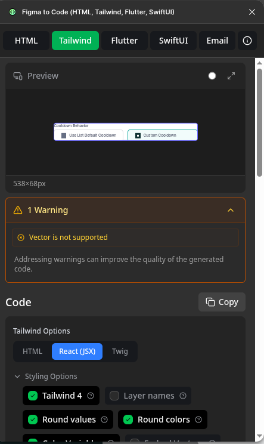
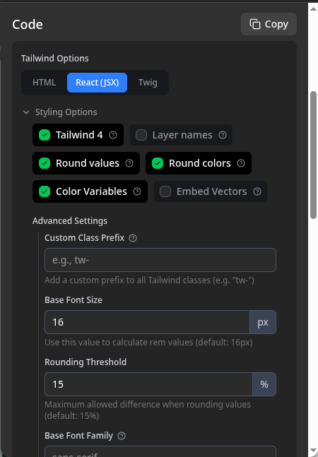
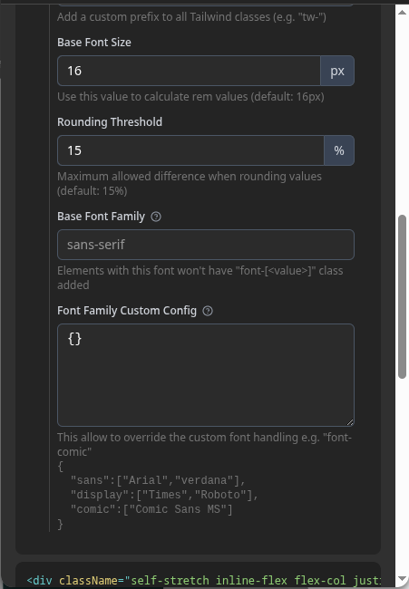

# By using figma extension + amazon Q for best setup

## Setup for figma extension

Extension Name is <strong>Figma to Code (HTML, Tailwind, Flutter, SwiftUI)</strong>

[Plugin Link](https://www.figma.com/community/plugin/842128343887142055/figma-to-code-html-tailwind-flutter-swiftui)
[Git Link](https://github.com/bernaferrari/figmatocode)

### Settings

Use tailwind tab with following settings:

## Setup for Amazom Q

Use auto model selection, give max context as possible, create auth feature on your own so then model will have context for it.
Create page.tsx and view.tsx and then give in later prompts the view name along with html. Also if there are any extra stuff like tables or something complex in ui then explicityl explain it to the AI.

## Prompt

You will be provided with raw static html, your job would be convert it to a proper react code in the specified page, you can always check other features (especially auth) how its created and its structure, major ui components are specified in /components/ui so use them where necessary and if a component does not exist then add them there, please remember to use one component per file.
