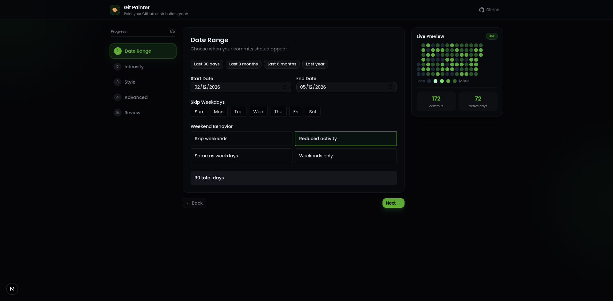
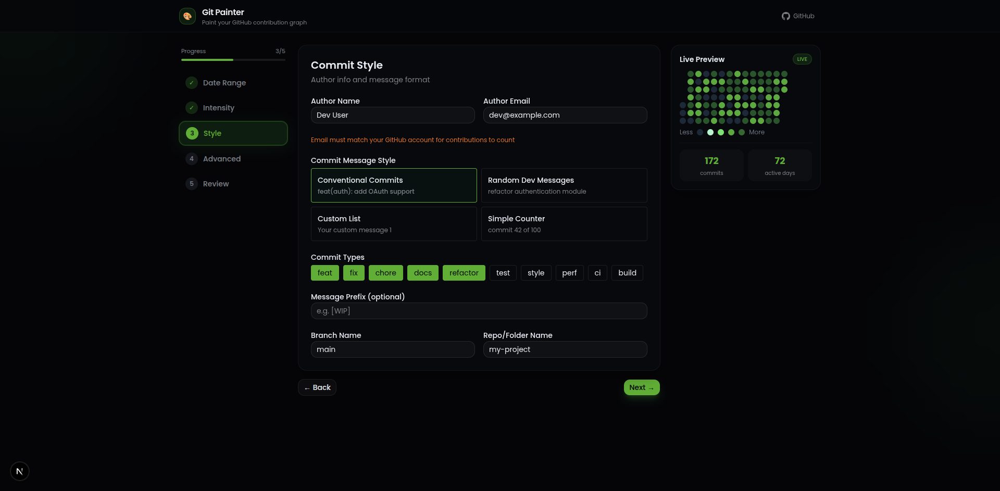
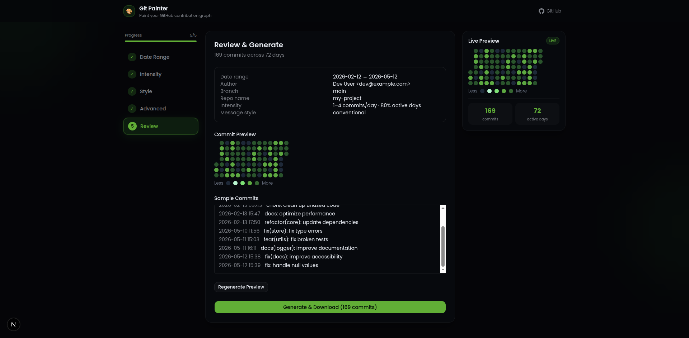

<div align="center">
  
  <h1>Git Painter</h1>
  <p>Paint your GitHub contribution graph with a fully custom commit history.</p>
</div>

---







---

## What is Git Painter?

Git Painter is a web app that lets you generate a real Git repository with commits crafted to paint any pattern on your GitHub contribution graph. Configure the date range, commit intensity, message style, and author details — then download a ready-to-push `.zip`.

## Features

- 📅 **Date Range** — pick any start/end date, skip weekdays, or control weekend behavior
- ⚡ **Intensity** — set min/max commits per day, active day percentage, and distribution curve
- 🎨 **Commit Style** — conventional commits, random messages, or custom templates
- ⚙️ **Advanced** — seed for reproducibility, file change modes, README content, GPG signing
- 🚀 **Live Preview** — real-time heatmap showing exactly what your graph will look like
- 📦 **One-click Download** — get a `.zip` with a real Git repo, ready to push

## Getting Started

```bash
pnpm install
pnpm dev
```

Open [http://localhost:3000](http://localhost:3000) in your browser.

## Usage

1. **Date Range** — choose the time window for your commits
2. **Intensity** — configure how many commits per day and how often
3. **Style** — set commit message format and author info
4. **Advanced** — tweak file changes, seed, and README
5. **Review** — preview the heatmap, then click **Generate & Download**
6. Unzip the file and push:

```bash
cd my-project
git remote add origin https://github.com/yourname/my-project.git
git push -u origin main --force
```

## Tech Stack

- [Next.js 15](https://nextjs.org) — App Router
- [Tailwind CSS v4](https://tailwindcss.com)
- [shadcn/ui](https://ui.shadcn.com)
- [Zustand](https://zustand-demo.pmnd.rs) — state management
- [date-fns](https://date-fns.org) — date utilities
- [JSZip](https://stuk.github.io/jszip) — zip generation

## License

MIT
